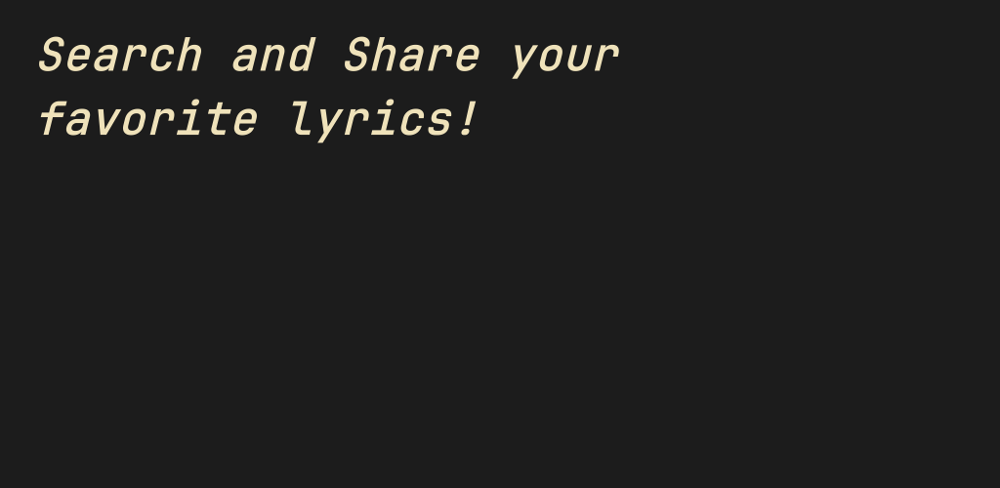
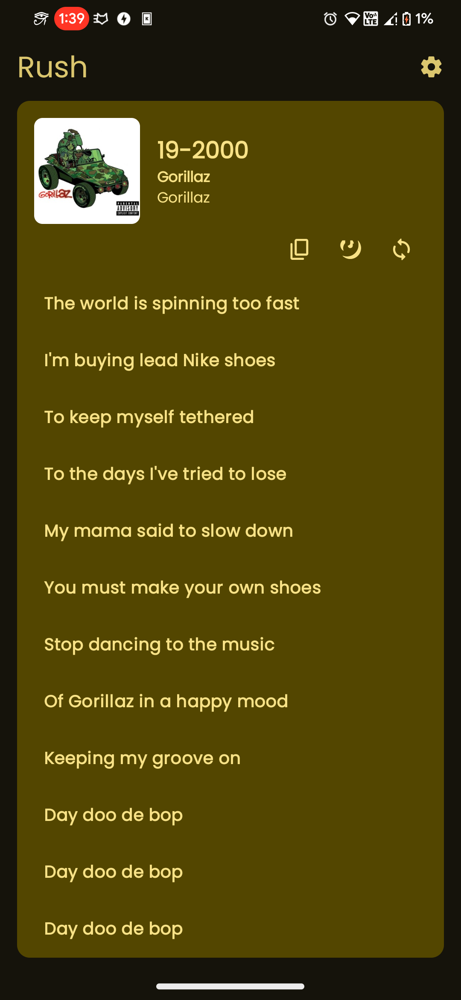
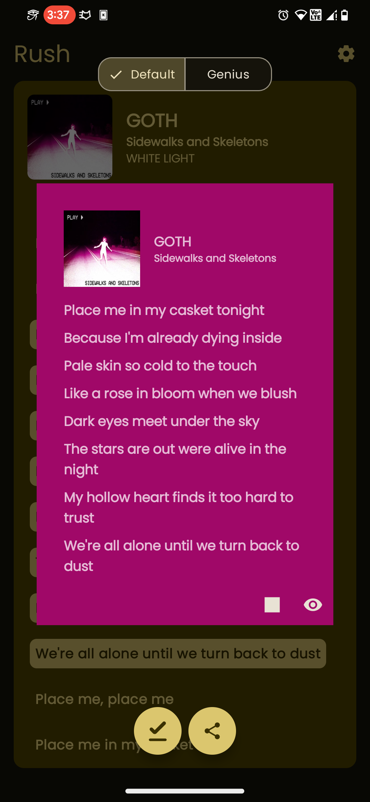
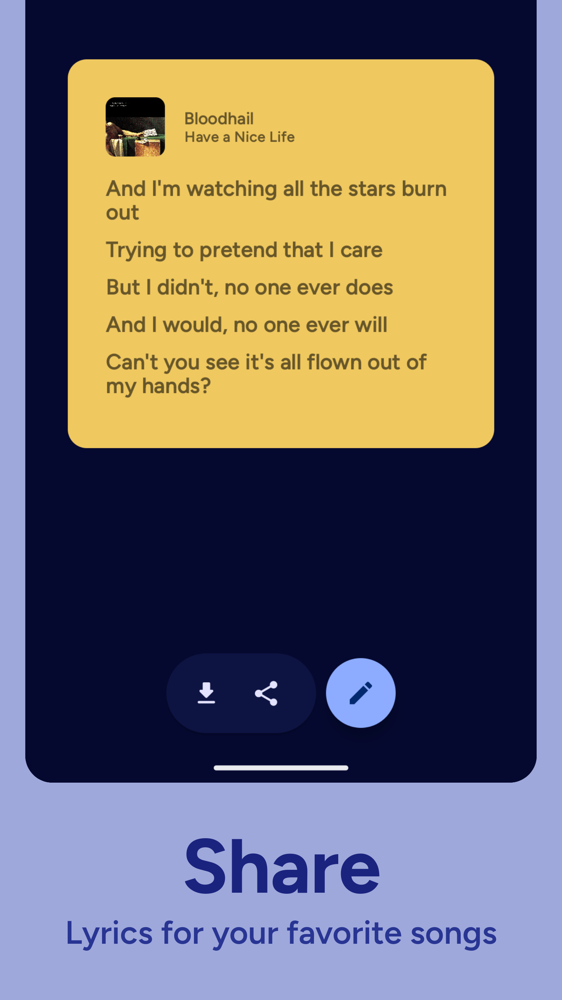
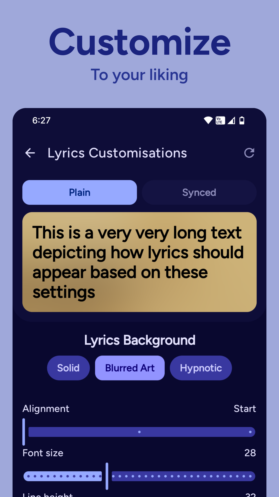
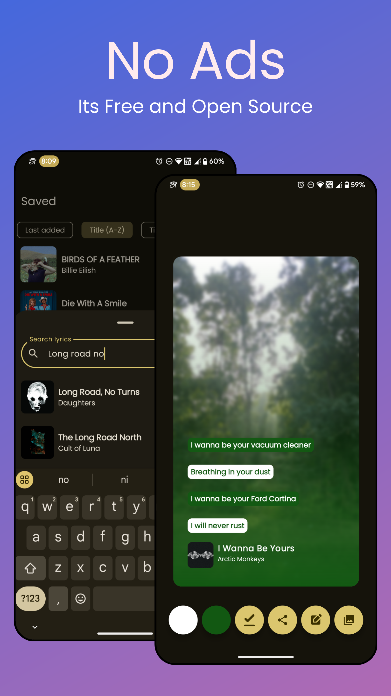

[](https://play.google.com/store/apps/details?id=com.shub39.rush.play)
[](https://github.com/shub39/Rush/releases)
[](https://apt.izzysoft.de/fdroid/index/apk/com.shub39.rush)
[](https://f-droid.org/en/packages/com.shub39.rush/)

## Screenshots

|  |  |
|:-------------------------------------------------------------------:|:-------------------------------------------------------------------:|
|  |  |
|  |  | 

## Features 

- [x] Search Lyrics
- [x] Download Lyrics
- [x] Share Lyrics
- [x] Customisations
- [x] Autofill current playing song in search 
- [x] Synced Lyrics
- [x] Import and Export saved lyrics

Checkout planned changes in [RoadMap](https://github.com/shub39/Rush/discussions/113)

## Motivation 

Spotify removed its feature to see and share lyrics from its free tier just to bring it back again. 
So, I made this app to get and store lyrics for my favorite songs from Genius and share them like Spotify,
all in Material 3 look. As an audiophile, This has now become my way to listen to complete albums with lyrics without 
dealing with genius's "UI".

## Stargazers over time

[](https://starchart.cc/shub39/Rush)

## Translations 

Translations are done via weblate, you can contribute there!
[](https://hosted.weblate.org/engage/rush/)
[](https://hosted.weblate.org/engage/rush/)

## Inspiration and Tech used

- [Fastlyrics](https://github.com/TecCheck/FastLyrics)
- [SongSync](https://github.com/Lambada10/SongSync)
- [LrcLib](https://lrclib.net/) 
- Spotify Lyrics UI
- Kotlin and Jetpack Compose 🖤
- [MaterialKolor](https://github.com/jordond/MaterialKolor)
- [ColorPicker Compose](https://github.com/skydoves/colorpicker-compose)
- [Revenuecat Android SDK](https://github.com/RevenueCat/purchases-android)
- [FileKit](https://github.com/vinceglb/filekit)
- [KSoup](https://github.com/fleeksoft/ksoup)
- [Landscapist](https://github.com/skydoves/landscapist)
- [Kmpalette](https://github.com/jordond/kmpalette)
- [Zoomable](https://github.com/usuiat/Zoomable)

# Contributing

Please read [CONTRIBUTING.md](CONTRIBUTING.md) for details on our code of conduct, and the process for submitting pull requests.

# Security

SHA-256 fingerprint for the signing certificate used for github releases
```text
0F:E1:B9:F4:4A:4D:B9:7E:C5:09:48:F5:18:9F:6B:43:00:71:6C:C6:D4:84:3F:56:98:D6:14:A2:15:2E:21:88
```