# Rush
### Search, save and share lyrics like Spotify! 

> 
> 
> 

> ### Stats and Socials
> 
> 
> 

> ### Get From
> 
> 
> 
> 
> 
> ### Or Get Latest [Release](https://github.com/shub39/Rush/releases) from Github

## Screenshots 📱

|  |  |
|:-------------------------------------------------------------------:|:-------------------------------------------------------------------:|
|  |  |
|  |  | 

## Features ✨
>- [x] Search Lyrics
>- [x] Download Lyrics
>- [x] Share Lyrics
>- [x] Customisations
>- [x] Auto-fill current playing song in search 
>- [x] Synced Lyrics
>- [x] Batch download lyrics
>- [x] Import and Export saved lyrics

## Why ❔
Spotify removed its feature to see and share lyrics from its free tier just to bring it back again. 
So, I made this app to get and store lyrics for my favorite songs from Genius and share them like Spotify,
all in Material 3 look. As an audiophile, This has now become my way to listen to complete albums with lyrics without 
dealing with genius's "UI".

## Translations 🔠
Translations are done via weblate, you can contribute there!

## References and Inspiration 💡

>- [Fastlyrics](https://github.com/TecCheck/FastLyrics)
>- [SongSync](https://github.com/Lambada10/SongSync)
>- [LrcLib](https://lrclib.net/) 
>- Spotify Lyrics UI

## How it works 🤔

Rush is not just a lyrics app. Users can share lyrics as cards too, for that it needs to depend on Genius API Album art
and other metadata. While genius provides accurate lyrics, It doesn't provide timed lyrics so it fetches that from LRCLIB
using the title and artist info provided by genius. Users can correct lyrics from LRCLIB with the correct lyrics feature.

Below are some Flowcharts I made so almost everyone can understand how Rush works

### Searching 🔍️

### Fetching 🎣

### Rush mode and Synced lyrics 💫

```mermaid
flowchart
	n1@{ label: "Rectangle" }
	n1@{ shape: "rounded", label: "Media Player" }
	style n1 stroke-width:2px,stroke-dasharray:5 5
	subgraph s1["App"]
		n3["Fetches 🎣"]
		n2["Searches 🔍️"]
	end
	n1 ---|Playback position| s1
	n1 ---|Title, Artist| n2
	n2 ---|Topmost search result| n3
```

## Stargazers over time ✨
