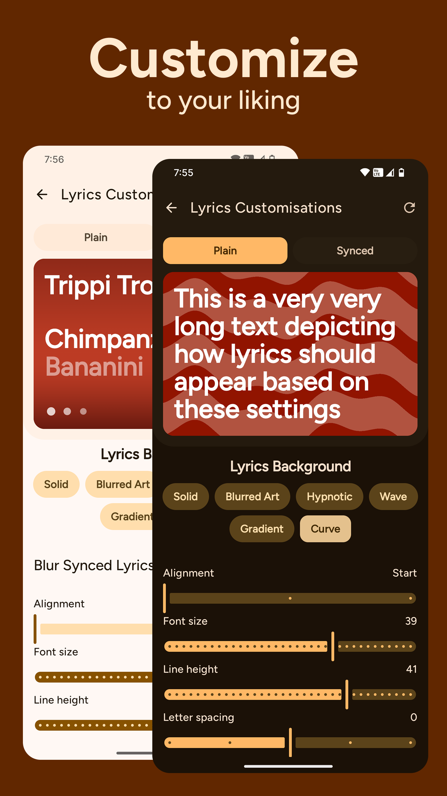

 

# 🌠 Rush 🌠

### 💫 Search, save and share lyrics like Spotify! 💫

 

### or Download latest from [Releases](https://github.com/shub39/Rush/releases)

## 🌟 Screenshots 🌟

|  |  |
|:-------------------------------------------------------------------:|:-------------------------------------------------------------------:|
|  |  |
|  |  | 
|  |  |

## 🌠 Features 🌠
- [x] Search Lyrics
- [x] Download Lyrics
- [x] Share Lyrics
- [x] Customisations
- [x] Auto-fill current playing song in search 
- [x] Synced Lyrics

## Why ❔
Spotify removed its feature to see and share lyrics from its free tier just to bring it back again. So, I made this app to get and store lyrics for my favorite songs from Genius and share them like Spotify, all in Material 3 look.

## 💭 Test and Discuss 💭

## 💡 References and Inspiration 💡

- [Fastlyrics](https://github.com/TecCheck/FastLyrics)
  
- [SongSync](https://github.com/Lambada10/SongSync)

- [LrcLib](https://lrclib.net/)
  
- Spotify Lyrics UI

## ⚒️ Tech Stack ⚒️

- [Retrofit](https://square.github.io/retrofit/) and [OkHttp](https://square.github.io/okhttp/) for api calls

- Database using [ROOM](https://developer.android.com/jetpack/androidx/releases/room)

- MVVM architecture

- Dependency injection using [Koin](https://insert-koin.io/docs/reference/koin-compose/compose/)

- [Fuel](https://github.com/kittinunf/fuel) and [Jsoup](https://jsoup.org/) for scraping

- [Coil](https://github.com/coil-kt/coil) for Images

- [Colorpicker-compose](https://github.com/skydoves/colorpicker-compose) for the colors!!

## Support 💕
If you love this app, consider supporting. I'm a undergrad trying to get some pocket money 🥹

	
