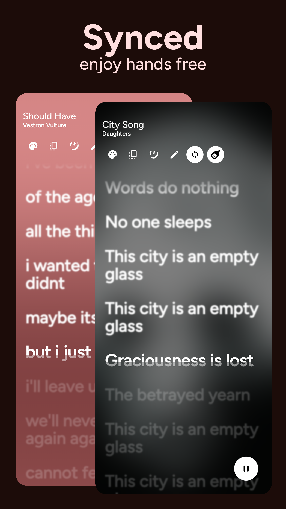

# Rush
### Search, save and share lyrics like Spotify! 

> 
> 
> 

> ### Stats and Socials
> 
> 
> 

> ### Get From
> 
> 
> ### Or Get Latest [Release](https://github.com/shub39/Rush/releases) from Github

## Screenshots 📱

|  |  |
|:-------------------------------------------------------------------:|:-------------------------------------------------------------------:|
|  |  |
|  |  | 
|  |  |

## Features / Road Map 🛣️
>- [x] Search Lyrics
>- [x] Download Lyrics
>- [x] Share Lyrics
>- [x] Customisations
>- [x] Auto-fill current playing song in search 
>- [x] Synced Lyrics
>- [x] Batch download lyrics
>- [x] Import and Export saved lyrics

## Why ❔
Spotify removed its feature to see and share lyrics from its free tier just to bring it back again. 
So, I made this app to get and store lyrics for my favorite songs from Genius and share them like Spotify,
all in Material 3 look. As an audiophile, This has now become my way to listen to complete albums with lyrics without 
dealing with genius's "UI".

## Translations 🔠

|            LANGUAGE            | UPDATED BY                                               |
|:------------------------------:|:---------------------------------------------------------|
|            English             | Myself                                                   |
|            Japanese            | [kuragehimekuara1](https://github.com/kuragehimekurara1) |
|            Italian             | [colozzacristian](https://github.com/colozzacristian)    |
|            Turkish             | [mikropsoft](https://github.com/mikropsoft)              |
|             French             | [Valyyme](https://github.com/Valyyme)                    |
|      Brazilian Portuguese      | [luxdev01](https://github.com/luxdev01)                  | 
| Simplified/Traditional Chinese | [AC19970](https://github.com/AC19970)                    |

## References and Inspiration 💡

>- [Fastlyrics](https://github.com/TecCheck/FastLyrics)
>- [SongSync](https://github.com/Lambada10/SongSync)
>- [LrcLib](https://lrclib.net/) 
>- Spotify Lyrics UI

## Tech Stack ⚒️

>- [Ktor](https://github.com/ktorio/ktor) for networking
>- [Ksoup](https://github.com/fleeksoft/ksoup) for parsing html
>- Database using [ROOM](https://developer.android.com/jetpack/androidx/releases/room)
>- MVI architecture
>- Dependency injection using [Koin](https://insert-koin.io/docs/reference/koin-compose/compose/)
>- [Landscapist](https://github.com/skydoves/landscapist) for Images
>- [Colorpicker-compose](https://github.com/skydoves/colorpicker-compose) for the color picker

## Support 💕
> ### If you love this app, consider supporting. I'm a undergrad trying to get some pocket money 🥹
> 

## Star History 🌟

