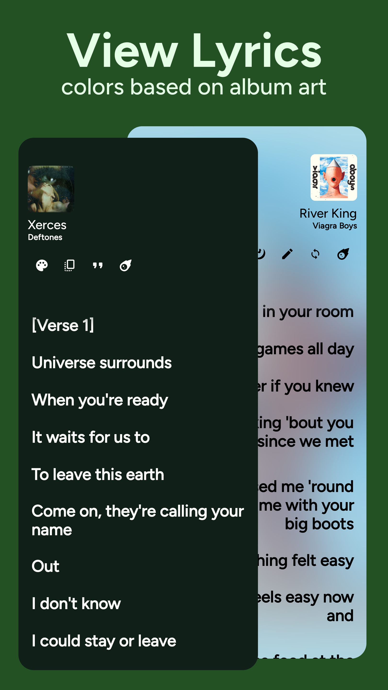
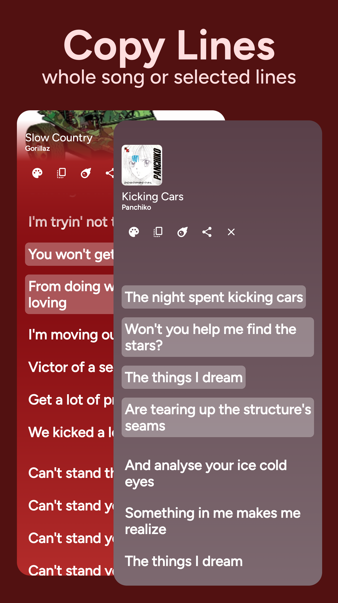
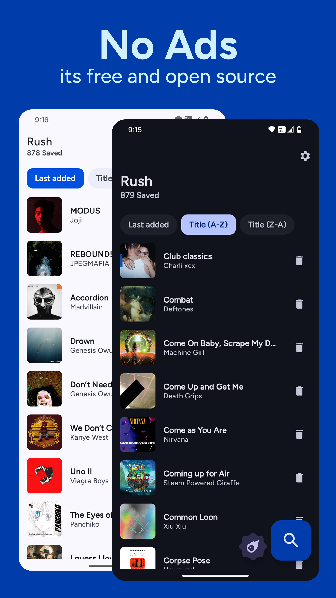

 

# 🌠 Rush 🌠

### Search, save and share lyrics like spotify! 💫

 

### or Download latest from [Releases](https://github.com/shub39/Rush/releases)

## Features 🌠
- [x] Search Lyrics
- [x] Download Lyrics
- [x] Share Lyrics
- [x] Customisations
- [x] Auto-Search current playing song   

## Why ❔
Spotify removed its feature to see and share lyrics from its free tier. So I made this app to get and store lyrics for my favorite songs from genius and share them like spotify, all in material3 look.
This app uses Genius Api to search for available songs and scrape lyrics from the song's page

## Screenshots 🌟

|  |  |  |
|:-------------------------------------------------------------------:|:-------------------------------------------------------------------:|:-------------------------------------------------------------------:|
|  |  |  |

## Support and Discuss 💭

## References and Inspiration 💡
- [Fastlyrics](https://github.com/TecCheck/FastLyrics)
  
- [SongSync](https://github.com/Lambada10/SongSync)
  
- Spotify Lyrics UI

## Tech Stack ⚒️

- Retrofit and Okhttp

- ROOM

- MVVM architecture

- Fuel and Jsoup
